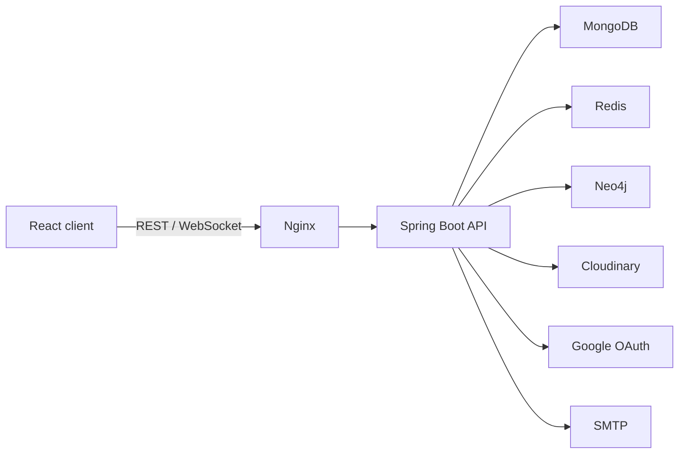

# Veyru

Veyru is a full-stack photo-sharing platform with social feeds, real-time messaging, notifications and graph-based recommendations.

[](https://github.com/tphuc263/veyru/actions/workflows/quality.yml)
[](LICENSE)

## Features

- HttpOnly cookie authentication, rotating refresh sessions, CSRF protection and Google OAuth2
- Photo uploads, likes, comments, favorites, follows and personalized feeds
- Real-time direct messages and notifications over STOMP WebSocket
- MongoDB persistence, Redis caching and Neo4j social-graph ranking
- Contract-first OpenAPI integration between Spring Boot and React
- Responsive React UI served by Nginx

## Architecture



| Area | Technology |
| --- | --- |
| Frontend | React 19, TypeScript, Vite, Nginx |
| Backend | Java 25, Spring Boot 4.1, Maven |
| Data | MongoDB 7, Redis 7, Neo4j 5 |
| API and real-time | OpenAPI, REST, STOMP WebSocket |
| Delivery | Docker Compose, GitHub Actions, GHCR |

## Quick start

Requirements: Docker with Docker Compose.

```bash
git clone https://github.com/tphuc263/veyru.git
cd veyru
cp .env.example .env
# Fill in the required Cloudinary, Google OAuth and SMTP credentials.
docker compose up --build
```

Open:

- Application: http://localhost:5173
- Swagger UI: http://localhost:8080/swagger-ui.html
- Neo4j Browser: http://localhost:7474

The root `.env` is used by Docker Compose. Direct backend development uses
`backend/.env`; the two files are intentionally separate and are never committed. Cloudinary,
Google OAuth and SMTP are required application dependencies, so startup fails with the missing
property name when any required configuration is absent.

Stop the stack with `docker compose down`. Add `--volumes` only when you also want to delete local database data.

## Development

Start only the data services:

```bash
docker compose up -d mongodb redis neo4j
```

Run the backend:

```bash
cd backend
cp ../.env.example .env
SPRING_PROFILES_ACTIVE=local ./mvnw spring-boot:run
```

Run the frontend in another terminal:

```bash
cd frontend
npm ci
npm run dev
```

Repository layout:

```text
backend/    Spring Boot API and committed OpenAPI contract
frontend/   React client, generated API types and Nginx configuration
compose.yml Full local stack
```

More detail is available in the [backend guide](backend/README.md) and [frontend guide](frontend/README.md).

## Deployment configuration

For a public backend deployment, provide configuration through the platform's environment-variable
or secret dashboard. Do not deploy a `.env` file. Startup fails before receiving traffic when
required credentials, URLs or the JWT signing key are missing. Use a Base64-encoded JWT key
containing at least 32 random bytes; Base64 is an encoding, not encryption.

Spring Boot applies profile files first and lets OS environment variables override them. This
repository keeps production-safe defaults in `application.yml` and localhost-only overrides in
`application-local.yml`. Only the local profile imports `backend/.env`. The application does not
expose Actuator's `env` or `configprops` endpoints.

## Quality checks

```bash
(cd backend && ./mvnw spotless:check test)
(cd frontend && npm run api:check && npm run lint && npm test && npm run build)
(cd frontend && npm run test:e2e)
```

Pull requests run backend and frontend checks independently. Tags matching `v*` publish both container images to GitHub Container Registry; the release workflow can also be started manually.

## API contract

The backend contract lives at `backend/openapi/openapi.json`. The frontend keeps a release copy at `frontend/openapi/openapi.json` and verifies its generated TypeScript types with `npm run api:check`.

## License

[MIT](LICENSE) © 2026 tphuc263
